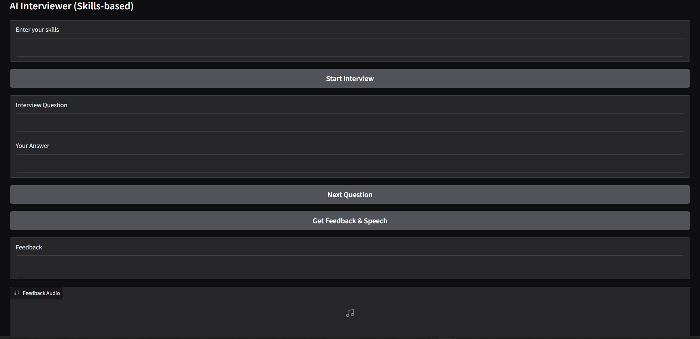

# AI Interviewer

An interactive AI-powered interviewer built with **Gradio**, **Google Generative AI (Gemini)**, and **gTTS (Text-to-Speech)**.

## Project Overview

This project simulates a real-time interview experience:

- Generates **custom interview questions** based on the user's skills.
- Lets the user **answer questions one by one**.
- Provides **AI-generated feedback** on the interview performance.
- Converts the feedback into **speech audio** for an interactive experience.

## Tech Stack

- **Python**
- **Gradio** — Web UI framework
- **Google Generative AI (Gemini 1.5 Flash)** — For question generation & feedback
- **gTTS** — To convert feedback text into speech
- **tempfile** — For managing temporary audio files

## How It Works

1. User enters a list of their skills.
2. The AI generates 5 interview questions tailored to those skills.
3. User answers each question through the interface.
4. After all questions, AI analyzes the interview and provides feedback:
    - Highlights mistakes.
    - Summarizes performance.
    - Outputs feedback as both text and audio.

## User Interface 



## Use Cases

- Interview practice for **students** and **job seekers**.
- Automated **mock interview coach**.
- Language and communication skills practice.
- HR training tool for **automated interview preparation**.


## Running the Project

### Prerequisites

- Python 3.8+
- Google Generative AI API key

### Installation

1. Clone the repository:
    ```bash
    git clone https://github.com/your-username/ai-interviewer.git
    cd ai-interviewer
    ```

2. Install dependencies:
    ```bash
    pip install -r requirements.txt
    ```

3. Add your Google Generative AI API key in your script:
    ```python
    genai.configure(api_key="YOUR_API_KEY")
    ```

4. Run the app:
    ```bash
    python app.py
    ```

5. Access the Gradio interface in your browser (usually at `http://127.0.0.1:7860`).


# AWS CI/CD Pipeline Project  

Architecture

        GitHub → CodePipeline → CodeBuild → (S3 / EC2 / ECS / Lambda)

    1. GitHub: Code repository for source control.

    2. CodePipeline: Manages triggers, stages, and workflow automation.

    3. CodeBuild: Compiles, tests, and builds application code.

    4. S3 / EC2 / ECS / Lambda: Deployment targets based on app requirements.

GitHub Integration

    1. Code is stored and version-controlled on GitHub.

    2. Supports various application stacks (Node.js, React, Java, etc.).

    3. Easily connect your GitHub repo to AWS.

Secure Permissions (IAM Roles & Policies)

Create dedicated IAM roles for CodePipeline and CodeBuild:

    Trusted Entity: AWS Service

    Use Case: CodePipeline or CodeBuild

Policies to attach:

    AWSCodePipelineFullAccess

    AWSCodeBuildAdminAccess

    AmazonS3FullAccess (for S3 deployment)

    AmazonEC2FullAccess (for EC2 deployment)

Adhere to least-privilege principles for enhanced security.

Branching and Automation

    Utilize GitHub branches for feature and staging workflows.

    Pipelines can trigger builds on specific branches (e.g., main, develop, or feature/*).

Build, Artifacts, and Deployment

    Build Artifacts: Output (e.g., static files, zip) from each build stored in S3.

    CodeBuild executes builds as per buildspec.yml.

Example buildspec.yml for the app:

    version: 0.2

    phases:
    install:
        runtime-versions:
        python: 3.10
        commands:
        - pip install --upgrade pip
        - pip install -r requirements.txt
    build:
        commands:
        - echo "Build complete. Launch manually if needed via Gradio."

    artifacts:
    files:
        - '**/*'
    base-directory: .

Artifacts are routed through CodePipeline for deployment stages:

    S3 for static web apps

    EC2/ECS/Lambda for backends and APIs

Typical CodeBuild Workflow
    install: Install required dependencies (npm, pip, etc.)

    pre_build: Setup configuration, environment variables

    build: Compile, test, bundle the application

    post_build: Package and upload artifacts to S3 or trigger deployment